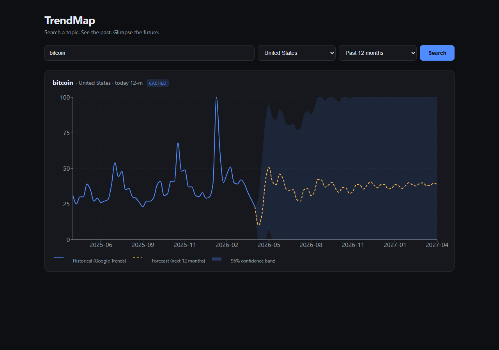
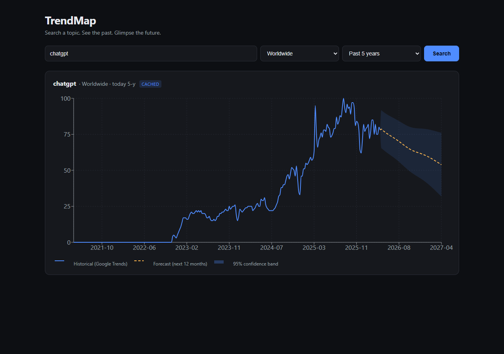
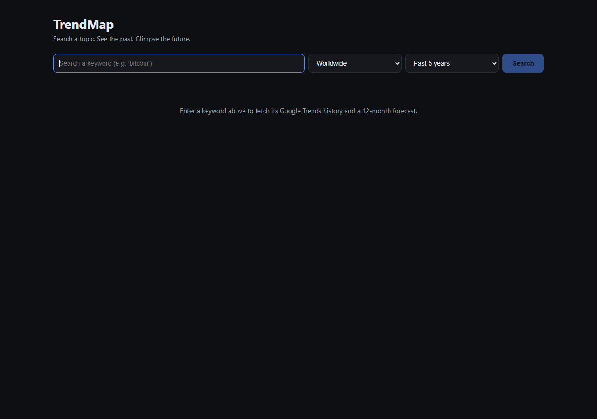
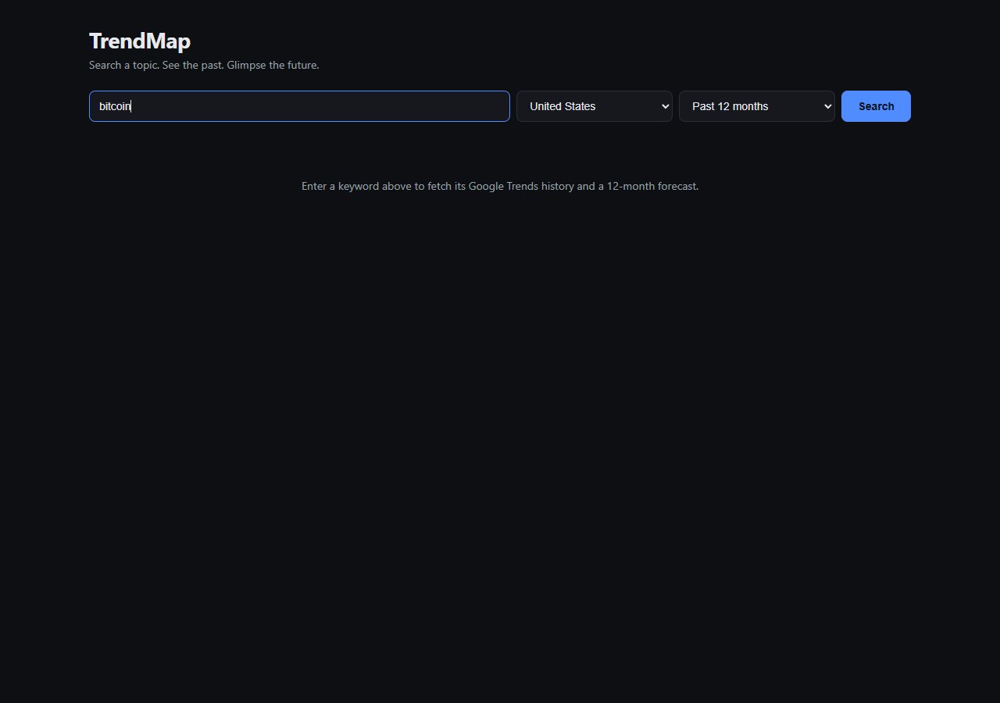

# TrendMap — How to Use

A step-by-step guide to running TrendMap locally and deploying it to Railway. Screenshots show the app in action.

---

## Table of contents

1. [What it does](#1-what-it-does)
2. [Prerequisites](#2-prerequisites)
3. [First-time setup](#3-first-time-setup)
4. [Run it locally](#4-run-it-locally)
5. [Use the app](#5-use-the-app)
6. [Deploy to Railway](#6-deploy-to-railway)
7. [API reference](#7-api-reference)
8. [Troubleshooting](#8-troubleshooting)

---

## 1. What it does

TrendMap fetches **real Google Trends data** for any keyword, then uses a **time-series forecasting model** to predict the next 12 months.

- **Solid blue line** — historical data straight from Google Trends.
- **Dashed yellow line** — predicted values (next 12 months).
- **Shaded blue band** — 95% confidence interval. Wide bands = high uncertainty.



A long-history example with a clear adoption curve:



---

## 2. Prerequisites

Install these once on your machine:

| Tool | Version | Check with |
| --- | --- | --- |
| .NET SDK | **8.0+** | `dotnet --version` |
| Node.js | **20+** | `node --version` |
| Python | **3.8+** | `python --version` |

If `python` opens the Microsoft Store on Windows, install Python from [python.org](https://www.python.org/downloads/) and tick **"Add Python to PATH"** during setup.

---

## 3. First-time setup

From the repo root:

```bash
# 1. Install the Python packages used to fetch Google Trends data
pip install -r src/TrendMap.Api/scripts/requirements.txt

# 2. Install the React frontend's npm packages
cd src/TrendMap.Web
npm install
cd ../..
```

That's it. No database, no API keys.

---

## 4. Run it locally

You can run it two ways:

### Option A — Single server (recommended for a quick look)

Build the React app once, then start only the .NET API. The API serves the React build from `wwwroot/`.

```bash
# Build the frontend
cd src/TrendMap.Web && npm run build && cd ../..

# Copy the build into the API's wwwroot
mkdir -p src/TrendMap.Api/wwwroot
cp -r src/TrendMap.Web/dist/* src/TrendMap.Api/wwwroot/

# Start the API
dotnet run --project src/TrendMap.Api --urls "http://localhost:5080"
```

Open **http://localhost:5080** in your browser.

### Option B — Two terminals (recommended for active development)

The Vite dev server gives you hot reload for the React side; it proxies `/api` requests to the .NET process.

```bash
# Terminal 1
dotnet run --project src/TrendMap.Api --urls "http://localhost:5080"

# Terminal 2
cd src/TrendMap.Web
npm run dev
```

Open **http://localhost:5173**.

---

## 5. Use the app

### Step 1 — open the app

You'll see an empty search form:



### Step 2 — type a keyword and pick filters

- **Keyword** — anything (e.g. `bitcoin`, `chatgpt`, `taylor swift`).
- **Region** — country to scope the data to, or **Worldwide** for global data.
- **Timeframe** — how much historical data to fetch. `Past 5 years` is the default.



### Step 3 — click Search

The first request takes **~5–15 seconds** (Google Trends fetch + forecast computation). After that, identical requests are served from an in-memory cache for **60 minutes** (you'll see a small `CACHED` badge):


### Reading the chart

| Element | What it means |
| --- | --- |
| **Solid blue line** | Real Google Trends interest scores (0–100, normalized). |
| **Dashed yellow line** | Forecast for the next 12 months. |
| **Dark shaded band** | 95% confidence interval — narrow = confident, wide = volatile. |
| `CACHED` badge | This response came from cache (not a fresh Google Trends fetch). |

Hover any point for the exact date and value.

### Tips

- **Compare scenarios** by changing region or timeframe and clicking Search again. Each combination is cached separately.
- **Wide confidence bands** (like the bitcoin example) tell you the model isn't sure — usually a sign of news-driven volatility.
- **Tight confidence bands** (like the chatgpt example) mean the trend is more predictable.

---

## 6. Deploy to Railway

The repo includes a multi-stage `Dockerfile` and `railway.json`. Railway will detect them automatically.

### Steps

1. **Push the repo to GitHub.**
2. Go to [railway.com](https://railway.com), click **New Project → Deploy from GitHub repo**, and pick this repo.
3. Railway will:
   - See `railway.json` and use the `Dockerfile` builder.
   - Build a single image with .NET 8 runtime + Python 3 + pytrends + your React assets.
   - Start the API listening on Railway's `$PORT`.
4. After the first deploy, open the service's **Settings → Networking** tab and click **Generate Domain**.
5. Visit the generated URL — the app is live.

### Optional environment variables (Railway → Variables tab)

| Variable | Default | Purpose |
| --- | --- | --- |
| `Trends__CacheMinutes` | `60` | How long to cache results per `(keyword, region, timeframe)`. |
| `Trends__DefaultTimeframe` | `today 5-y` | Used if a request omits `timeframe`. |
| `Trends__PythonExecutable` | `/opt/venv/bin/python` | The Python interpreter the API shells out to. Don't change this in Docker. |

### Building the Docker image locally (optional sanity check)

```bash
docker build -t trendmap .
docker run -p 8080:8080 trendmap
# Open http://localhost:8080
```

---

## 7. API reference

The .NET API exposes two endpoints. Both are JSON.

### `GET /api/health`

Liveness probe used by Railway.

```bash
curl http://localhost:5080/api/health
# → {"status":"ok"}
```

### `POST /api/trends`

Fetch historical Google Trends data + 12-month forecast.

**Request:**

```bash
curl -X POST http://localhost:5080/api/trends \
  -H "Content-Type: application/json" \
  -d '{"keyword":"bitcoin","geo":"US","timeframe":"today 12-m"}'
```

**Body fields:**

| Field | Required | Notes |
| --- | --- | --- |
| `keyword` | yes | The search term. |
| `geo` | no | ISO-3166 alpha-2 country code (e.g. `US`, `GB`, `BR`). Empty string = worldwide. |
| `timeframe` | no | pytrends format. Common: `today 5-y`, `today 12-m`, `today 3-m`, `all`. Defaults to `today 5-y`. |

**Response (truncated):**

```json
{
  "keyword": "bitcoin",
  "geo": "US",
  "timeframe": "today 12-m",
  "historical": [
    { "date": "2025-04-20", "value": 31 },
    { "date": "2025-04-27", "value": 26 }
  ],
  "forecast": [
    {
      "date": "2026-04-26",
      "value": 9.99,
      "lowerBound": 0,
      "upperBound": 29.58
    }
  ],
  "fromCache": false
}
```

| Status | Meaning |
| --- | --- |
| `200` | OK. |
| `400` | Missing/invalid keyword. |
| `502` | Google Trends call failed (rate-limited, no data, etc.). The body's `error` field has details. |
| `504` | Trends fetch took longer than 45 seconds. |

---

## 8. Troubleshooting

### `Google Trends fetch timed out (45s)` on every request

On Windows, `python` may resolve to the Microsoft Store stub at `C:\Users\<you>\AppData\Local\Microsoft\WindowsApps\python.exe`. The stub opens a popup instead of running, so the .NET subprocess hangs.

**Fix:** install Python from [python.org](https://www.python.org/downloads/), making sure to tick **"Add Python to PATH"**. The API auto-skips the WindowsApps stub when scanning `PATH`, but the real Python must be present somewhere else on `PATH`.

To verify, run `where python` — you want to see at least one entry that is **not** in `WindowsApps`.

### `pytrends` 502 with `method_whitelist` error

`pytrends 4.9.2` is incompatible with `urllib3 2.x`. The `requirements.txt` already pins `urllib3<2` and `requests<2.32`. If you see this error, reinstall:

```bash
pip install --force-reinstall -r src/TrendMap.Api/scripts/requirements.txt
```

### Google Trends returns `429` / no data

Google rate-limits the unofficial endpoint that `pytrends` uses. Symptoms:

- HTTP 502 from `/api/trends` with a message like `Google Trends request failed`.
- Sudden failures after several rapid requests.

**Mitigations** (already built in):

- 60-minute in-memory cache by `(keyword, geo, timeframe)`.
- 45-second per-request timeout (returns 504 instead of hanging the UI).

If you're hitting limits constantly, slow down or wait an hour. There is no official Google Trends API.

### "No data for keyword 'X' in geo 'Y'"

Google Trends has no data for that combination. Try a more popular term or a broader region (Worldwide).

### Port 5080 already in use

Pick a different port:

```bash
dotnet run --project src/TrendMap.Api --urls "http://localhost:6080"
```

If you're using **Option B (two terminals)**, also update `vite.config.ts`:

```ts
proxy: { "/api": "http://localhost:6080" }
```

### Wide confidence bands look "wrong"

They're not. The forecasting model (ML.NET's Singular Spectrum Analysis) widens its 95% bands when the historical signal is volatile. A wide band means *"I don't know — the data swings too much for me to be confident"*. Treat the dashed line as the central estimate and the band as the realistic range.
